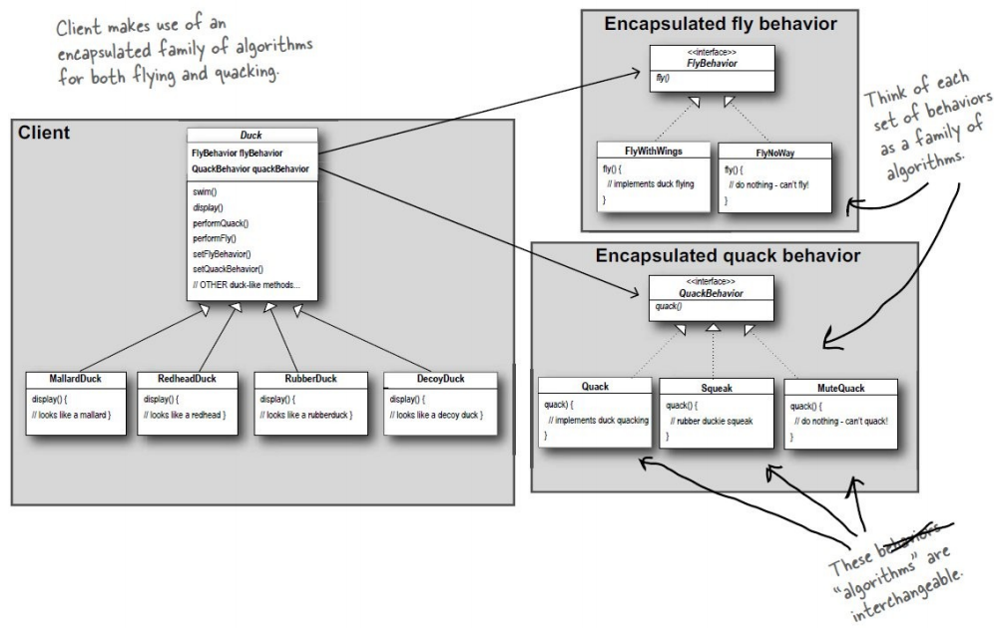

[back](README.md)

# Strategy Pattern

### Problem
Wir haben eine Superklasse und die dazugehörigen Unterklassen. Wir wollen nun eine Methode hinzufügen. Allerdings fällt uns auf, dass nicht jede Unterklasse die Methode auf die gleiche Art und Weise benutzen soll. Somit müssen wir nun einen Weg finden, diese Methode an die jeweilige Unterklasse anzupassen. Also die erste Unterklasse hat die Methode in der Variante A, die zweite in der Variante B usw. Natürlich kann eine Variante auch mehrmals benutzt werden.

### Lösung

Es gebe jetzt einige verschiedene Möglichkeit dieses Problem zu lösen. Allerdings haben die Wege, welche den meisten Leuten einfallen, immer auch weitere Probleme.

1. *Methode in der Superklasse:*  
Mit einer Methode in der Superklasse die erstellt und implementiert wird, haben zwar alle Unterklassen, welche die Methode benötigen, diese, allerdings hat dadurch auch jede andere Unterklasse diese Methode. Dies ist nicht gut, da nicht alle Unterklassen die Methode gleich implementieren wollen oder sie gar überhaupt nicht haben wollen. Für jede einzelne dieser müsste man die Methode überschreiben. Somit ist dieser Lösungsvorschlag vor allem bei größeren Projekten nicht zu empfehlen.
2. *Interfaces:*  
Eine weitere Möglichkeit wären Interfaces für jede dieser benötigten Methoden. Hier müssten alle Unterklassen, welche die Methode benötigen, das Interface implementieren. Hier haben wir aber das Problem, dass jede Unterklasse nun die Methode neu erstellen müsste. Dadurch kann es sein, dass der gleiche Code mehrmals auftaucht, in den verschiedenen Klassen. Würde man diesen dann auch noch ändern wollen, müsste man dies in jeder Unterklasse tun. Das alles führt zu einer weiteren, nicht idealen Lösung.
3. ***Strategy Pattern:***  
Beim Strategy Pattern werden nun die ersten 3 OO Principles umgesetzt. **Z**uerst wird alles, was sich ändern kann, aussortiert und in einen seperaten "Bereich" (Klassen, ...) gepackt. Somit befindet sich nun alles, was sich ändern kann, außerhalb der Klassenhierarchie. Bei Änderungen muss diese nicht mehr geändert werden. **I**n dem seperaten "Bereich" haben wir nun ein Interface. In diesem Interface befindet sich nur die eine Methode, welche mehrere Implementationen haben soll. Nun erstellt man für jede Variante der Methode eine Klasse, welche das Interface implementiert. **D**araufhin kann man nun in der Superklasse ein Objekt mit der Variante der Methode erstellen (ich erstelle eine Objekt von KlasseA, da ich die Variante A der Methode benötige). Mit Setter-Methoden kann man die Variante auch während der Laufzeit ändern, was bei der Vererbung nicht möglich wäre.

### Beispiel & UML

<small>[Head First Design Patterns](http://shop.oreilly.com/product/9780596007126.do) Seite 22</small>

Dieses Bild zeigt ein Beispiel und UML-Diagramm aus dem Buch "Head First Design Patterns". Hier haben wir die Superklasse "Duck", also Ente. Allerdings gibt es auch Unterklassen bzw. Arten von Enten. Nicht jede Entenart kann fliegen. Somit wurde für die Methode "fly", also fliegen, ein Interface mit Klassen welche diese Methode implementieren, erstellt. Das selbe gilt auch für das Quacken von Enten. Somit kann sich jede Entenart ihr "Quackbehavior" und "Flybehavior" aussuchen. Hierfür werden dann HAS-A-Beziehungen genutzt. IS-A-Beziehungen gibt es bei Vererbung. Die Mallord Ente ist eine Ente (sie erbt von "Duck"). Bei den Behaviors haben wir eine HAS-A-Beziehung, dass heißt, dass eine Ente ein Flugverhalten. Eine Ente ist kein Flugverhalten, aber hat ein Flugverhalten. Das bedeutet, dass hier in der Superklasse ein Attribut vom Typ Flybehavior und eines vom Typ Quackbehavior deklariert wird. Um diese dann während der Laufzeit ändern zu können, hat man dann Setter-Methoden und man kann sie auch in dem Konstruktor initialisieren. Somit kann man dann für jede vorhandene Ente und auch für jede neu hinzugefügte Ente das Verhalten bestimmen, ohne, dass Code mehrfach vorkommt und das alles auch noch während der Laufzeit. Falls sich plötlich eine fliegende Ente einen Flügel bricht, wird sie nicht mehr fliegen können.

### Beispielcode

Hier haben wir ein ähnliches Beispiel, aber statt Enten haben wir nun Katzen.
Katzen haben hier ein Jagdverhalten und geben verschiedene Laute von sich.

~~~ java
public abstract class Cat {
    HuntingBehavior huntingbehavior;
    SoundBehavior soundbehavior;

    public void setHuntingbehavior(HuntingBehavior huntingbehavior) {
        this.huntingbehavior = huntingbehavior;
    }

    public void setSoundbehavior(SoundBehavior soundbehavior) {
        this.soundbehavior = soundbehavior;
    }

    public abstract void display();

    public void performHunt(){
        huntingbehavior.hunt();
    }

    public void makeSound(){
        soundbehavior.makesound();
    }

    public void beFluffy() {
        System.out.println("All cats are fluffy!");
    }
}

public class Lion extends Cat {
    public Lion() {
        huntingbehavior = new HuntInGroup();
        soundbehavior = new Roar();
    }

    @Override
    public void display() {
        System.out.println("Lion");
    }
}
~~~

Ein Interface für die verschiedenen Laute, welche Katzen von sich geben können und eine Klasse, welche das Interface implmentiert hat.
~~~ java
public interface SoundBehavior {
    void makesound();
}

public class Roar implements SoundBehavior {
    @Override
    public void makesound() {
        System.out.println("roar");
    }
}
~~~
Ein Interface für die verschiedenen Jagdverhalten einer Katze und eine Klasse, welche das Interface implmentiert hat.
~~~ java
public interface HuntingBehavior {
    void hunt();
}
public class HuntInGroup implements HuntingBehavior {

    @Override
    public void hunt() {
        System.out.println("hunt in group");
    }
}
~~~